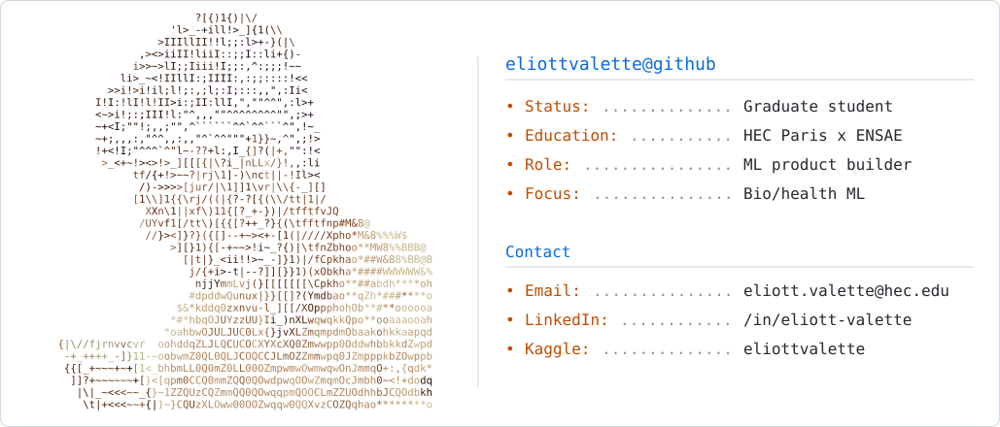

<picture>
  <source media="(prefers-color-scheme: dark)" srcset="assets/profile-dark-v5.svg">
  <source media="(prefers-color-scheme: light)" srcset="assets/profile-light-v5.svg">
  
</picture>

 

## VALETTE Eliott

I build ML products end to end, with a focus on bio/health R&D workflows and production-ready deployment. Recent work includes protein-focused ML pipelines and genomics-driven modeling. RL and 3D simulation are personal interests; I also ship interactive web experiences with Next.js and Three.js. Pragmatic deployment: Docker on Ubuntu, CI/CD, and reproducible pipelines.

## Highlights
- [MISTRAL-AI-MCP-HACKATHON](https://github.com/eliottvalette/MISTRAL-AI-MCP-HACKATHON): MCP-first Clash Royale demo for Mistral AI's MCP Hackathon, with a Next.js UI and an MCP agent playing in real time.
- Stealth bio/health ML product work (protein-focused ML pipelines, genomics-driven modeling, production deployment).

## Selected Projects
- [RL-in-3D-Physics-Engine](https://github.com/eliottvalette/RL-in-3D-Physics-Engine): Python rigid-body physics + RL sandbox with a quadruped agent.
- [Poker-GTO](https://github.com/eliottvalette/Poker-GTO): CFR+ solver with a PyTorch policy approximation and a Next.js UI.
- [Physics-Engine-in-C](https://github.com/eliottvalette/Physics-Engine-in-C): C-based multi-pendulum simulations with CSV outputs and Python visualization.
- [ISIC-2024-Hackathon](https://github.com/eliottvalette/ISIC-2024-Hackathon): Skin lesion classification using CNNs and gradient boosting.
- [Fighting-Tanks-Reinforcement-Learning](https://github.com/eliottvalette/Fighting-Tanks-Reinforcement-Learning): Multi-agent RL tank battle environment.

## Focus
- ML productization, evaluation, and deployment (bio/health)
- 3D simulation and physics
- Real-time web apps (Next.js, React, Three.js)

## Stack
- Python, TypeScript/JavaScript, SQL
- PyTorch, TensorFlow/Keras, scikit-learn, LightGBM
- Next.js, React, Three.js, WebGL, Tailwind CSS
- Docker, Linux (Ubuntu), MLflow, GitHub Actions

## Contact
- Email: eliott.valette@hec.edu
- LinkedIn: https://www.linkedin.com/in/eliott-valette/
- Kaggle: https://www.kaggle.com/eliottvalette
- LeetCode: https://leetcode.com/eliottvalette/

Last updated: February 2026
